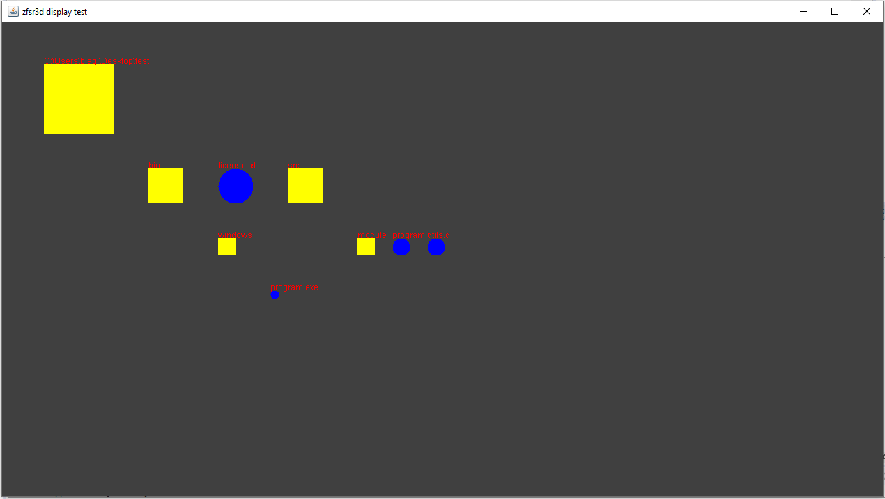
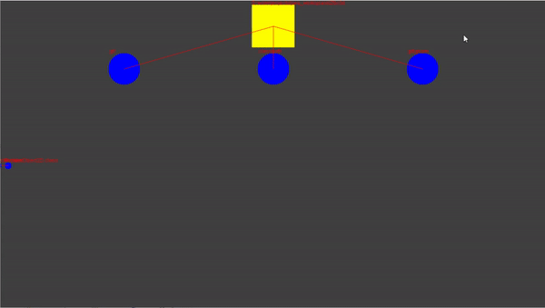
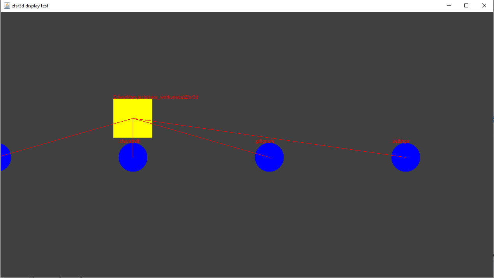
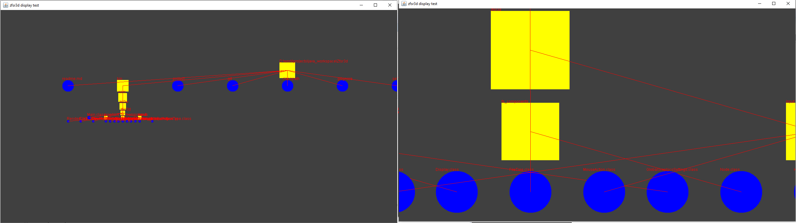
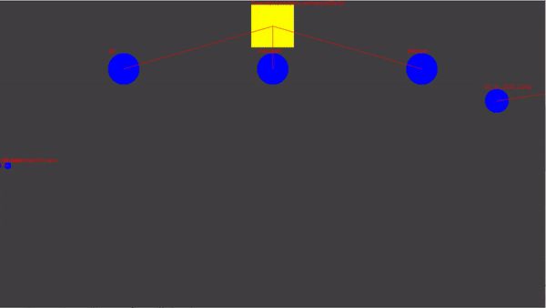
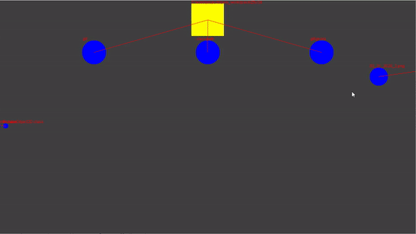
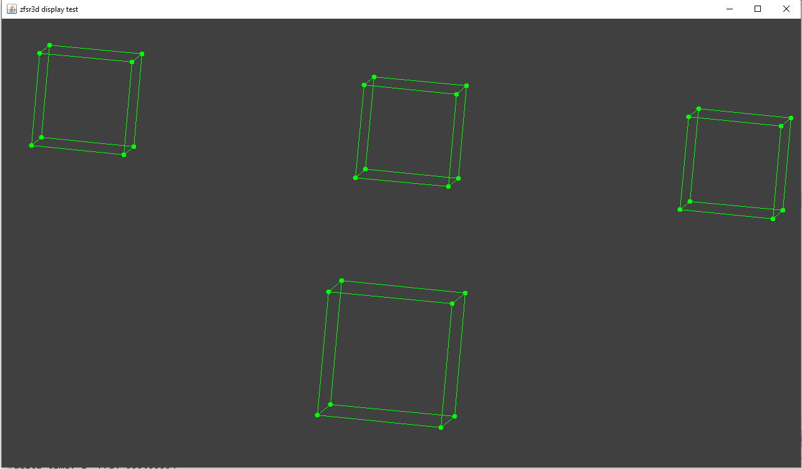

# Zn0w File System Representation 3D
I am making a program that can visualise file system (your dirs and files).
Inspired by the file system visualisation program featured in the dinosaur movie.
## Log
### 3/19/2020
I have just added a basic visual representation of the test directory (and all it's contents, recursively).

### 3/21/2020
* dynamic camera: camera movement, camera zoom (scaling)
* better positioning of graphic nodes
* keyboard & mouse input handling
* graphic representation: lines connecting parent-child, show all names toggle

### 4/4/2020
* treeview: hide/expand child nodes feature

* added a dynamic 2D view of file system (user can navigate through file system using this mode, like the standard system's file explorer)
* switching between view modes (treeview, dynamic 2d view)

* started to work on 3D rendering pipeline
* added RenderObject3D data structures, test rendering for the dynamic 3D view
